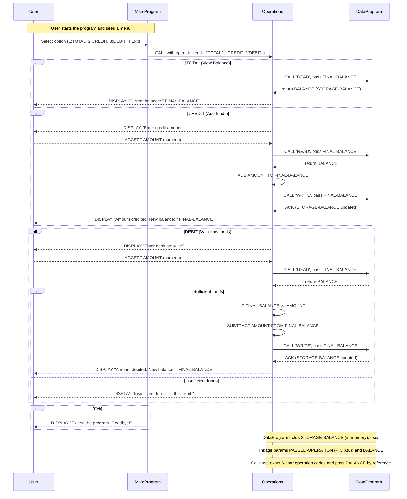

# COBOL Account Management - Documentation

This document describes the purpose and key routines of the COBOL sources in `src/cobol/` and the business rules implemented for student accounts.

## Project overview

A tiny COBOL account-management sample split across three programs:
- `main.cob` — user-facing menu and program control.
- `operations.cob` — implements the core operations (view, credit, debit).
- `data.cob` — holds the (in-memory) storage for the account balance and provides simple read/write access.

> Note: The code uses an in-memory `STORAGE-BALANCE` variable (initialized to 1000.00). There is no file or DB persistence. For any persistence or multi-user behavior, add a stable backing store and synchronization.

## File-by-file purpose and key routines

### `main.cob`
Purpose: Program entry and user menu. Presents choices, accepts user input, and dispatches to the `Operations` program.

Key flow and items:
- `PROGRAM-ID. MainProgram.`
- Working-storage:
  - `USER-CHOICE` (PIC 9) — menu choice.
  - `CONTINUE-FLAG` (PIC X(3)) — loop control (`YES`/`NO`).
- `MAIN-LOGIC` loop: displays menu options and accepts `USER-CHOICE`.
- Dispatches to `Operations` via CALL using one of the operation strings: `'TOTAL '`, `'CREDIT'`, `'DEBIT '`.

Notes:
- The operation strings include spaces in some cases (padded to 6 chars) to match the receiving programs' PIC X(6).

### `operations.cob`
Purpose: Implements the user operations: view total balance, credit account, and debit account.

Key routines and behavior:
- `PROGRAM-ID. Operations.`
- Working-storage:
  - `OPERATION-TYPE` (PIC X(6)) — holds the passed operation code.
  - `AMOUNT` (PIC 9(6)V99) — amount to credit/debit.
  - `FINAL-BALANCE` (PIC 9(6)V99) — local copy of the balance.
- Linkage:
  - `PASSED-OPERATION` (PIC X(6)) — operation code passed from caller.
- `PROCEDURE DIVISION USING PASSED-OPERATION.` Moves the passed operation into `OPERATION-TYPE` and selects behavior:
  - `TOTAL ` — calls `DataProgram` with `READ` and displays the `FINAL-BALANCE`.
  - `CREDIT` — prompts for credit `AMOUNT`, reads current balance, adds `AMOUNT`, writes back balance via `DataProgram`, displays new balance.
  - `DEBIT ` — prompts for debit `AMOUNT`, reads current balance, checks if sufficient funds, subtracts and writes the new balance or displays "Insufficient funds".

Notes:
- Calls `DataProgram` with the literal operation strings `'READ'` and `'WRITE'` and passes the `FINAL-BALANCE` value.
- Basic input via `ACCEPT` and output via `DISPLAY`.

### `data.cob`
Purpose: Simple in-memory data handler for the account balance. Provides read/write semantics through a `DataProgram` interface.

Key data items:
- `STORAGE-BALANCE` (PIC 9(6)V99) — program-level storage for the account balance. Initialized to `1000.00`.
- `OPERATION-TYPE` (PIC X(6)) — internal op code.
- Linkage section parameters: `PASSED-OPERATION` (PIC X(6)) and `BALANCE` (PIC 9(6)V99).

Key routine:
- `PROCEDURE DIVISION USING PASSED-OPERATION BALANCE.`
  - Moves `PASSED-OPERATION` to `OPERATION-TYPE`.
  - If `OPERATION-TYPE = 'READ'` then moves `STORAGE-BALANCE` to the passed `BALANCE`.
  - Else if `OPERATION-TYPE = 'WRITE'` then moves the passed `BALANCE` into `STORAGE-BALANCE`.
  - `GOBACK` to return to caller.

Notes:
- This is an in-memory single-value store. It assumes a single runtime and not multiple concurrent callers.

## Business rules related to student accounts (as implemented)

These are the explicit/implicit rules implemented by the current codebase for the account/balance logic:

- Initial balance: Each run starts with `STORAGE-BALANCE = 1000.00` (set in `data.cob`).
- View balance: The `TOTAL` operation reads and displays the current balance.
- Credit: The `CREDIT` operation prompts the user for an amount, then increases the balance by that amount and persists it into `STORAGE-BALANCE`.
- Debit: The `DEBIT` operation prompts for an amount and only allows the debit if `FINAL-BALANCE >= AMOUNT`. If insufficient funds, the debit is rejected and a message is displayed. There is no overdraft allowed.
- Amount format: Amounts use `PIC 9(6)V99` (maximum 6 digits before the decimal and 2 decimal places), so the system won't accept amounts outside that numeric range.
- Operation codes: Operation names are expected to be exactly 6 characters (space-padded where needed), e.g., `'TOTAL '` and `'DEBIT '`—this is important because the programs compare exact PIC X(6) strings.

## Assumptions & recommended improvements

Assumptions made by the current implementation:
- A single, in-memory balance is sufficient (no persistence or multi-user support).
- User input is numeric and fits in PIC 9(6)V99.
- Operation codes are fixed-width, 6-character strings.

Recommended low-risk improvements:
- Trim or normalize operation strings (avoid reliance on padded spaces) to improve robustness.
- Add input validation for `ACCEPT`ed amounts (non-numeric, negative values, and overflow checks).
- Replace the single in-memory `STORAGE-BALANCE` with a persisted store (file or DB) if the balance must survive process restarts.
- Add program-level error handling for malformed calls or missing linkage parameters.
- Add unit/integration tests or a small test harness to automate validation of credit/debit flows.

## How to run (local developer note)

This is COBOL source. How you run it depends on your COBOL toolchain. A typical approach with GnuCOBOL:

1. Compile each source file to an object/executable, ensuring CALL linkage names match.
2. Run/link the `MainProgram` as the entry point.

Example (platform/tooling dependent):
- `cobc -x -o main main.cob operations.cob data.cob` (GnuCOBOL)
- `./main`

Adjust the compile/link commands to match your COBOL compiler.

## Contact / Next steps

If you'd like, I can:
- Normalize operation codes and update the code to use trimmed strings.
- Add input validation and error messages for non-numeric or out-of-range amounts.
- Add persistence to `data.cob` (file-based) with simple CSV or indexed file storage.

---
Generated from the current source in `src/cobol/` on analysis. If you want changes to the README wording or to include inline code excerpts, tell me which parts to expand.

## Sequence diagram (Mermaid)

The following Mermaid sequence diagram shows the runtime data flow and interactions between the user, `MainProgram`, `Operations`, and `DataProgram` for the `TOTAL`, `CREDIT`, and `DEBIT` flows.

